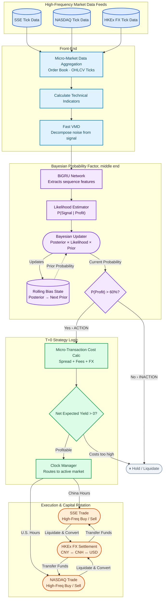

# Dual-market-capital-rotation-strategy-VMD-BiGRU-model

# High-Frequency T+0 Trading Architecture

This diagram illustrates the data flow, signal processing, Bayesian probability updating, and cross-market execution logic for our global T+0 trading strategy.

## System Flowchart

## Breakdown

*   **Data Feeds**: Ingests high-frequency tick data from SSE, NASDAQ, and HKEx.
*   **Front-End**: Handles raw data aggregation, technical indicator calculation, and noise-signal decomposition using Fast VMD.
*   **Middle-End**: Employs a BiGRU network and Bayesian probability updating to dynamically predict trade profitability. 
*   **Back-End**: Calculates micro-transaction costs and manages market routing based on the active trading clock.
*   **Execution**: Manages the actual high-frequency buying/selling and handles capital rotation (currency conversion) between the US and Chinese markets via HKEx FX settlement.
