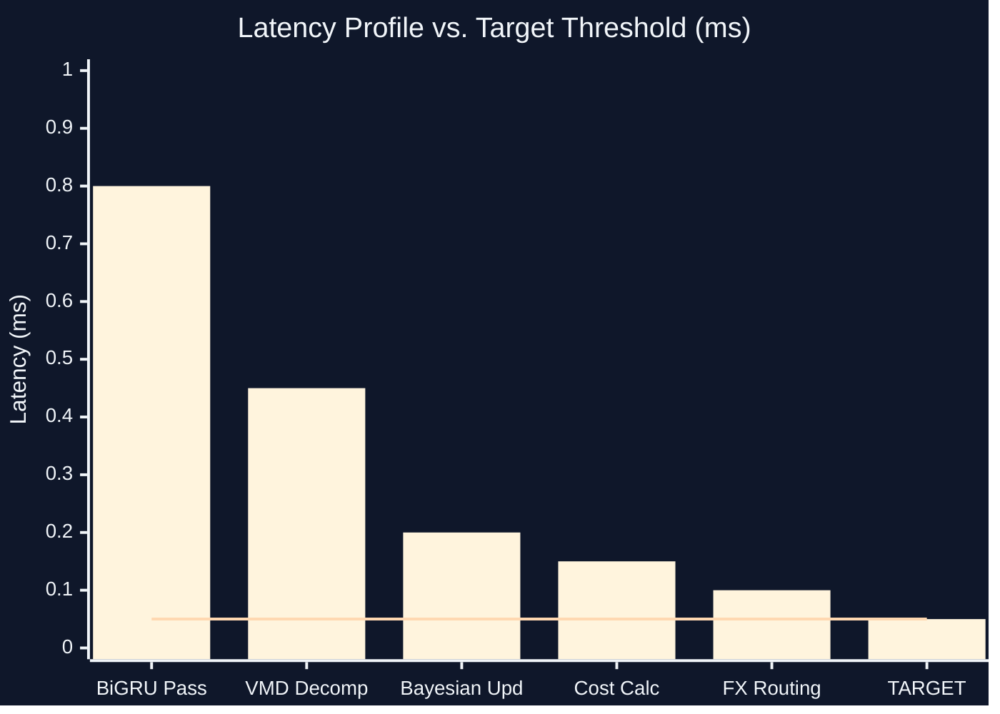
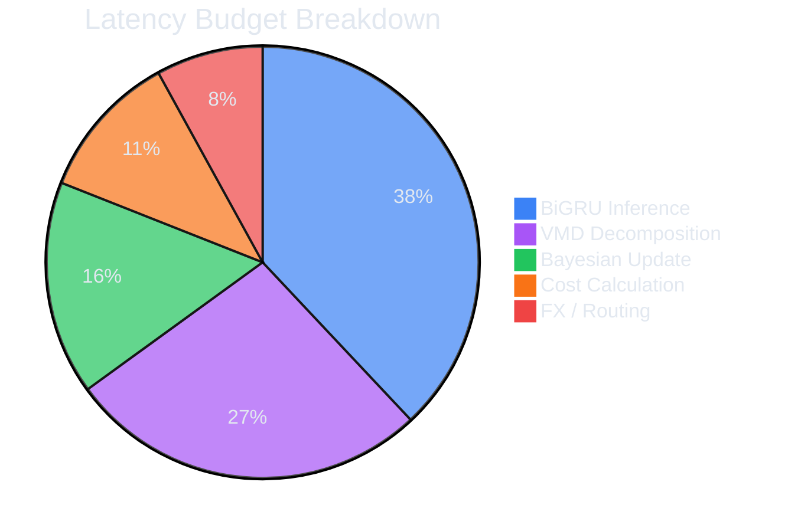
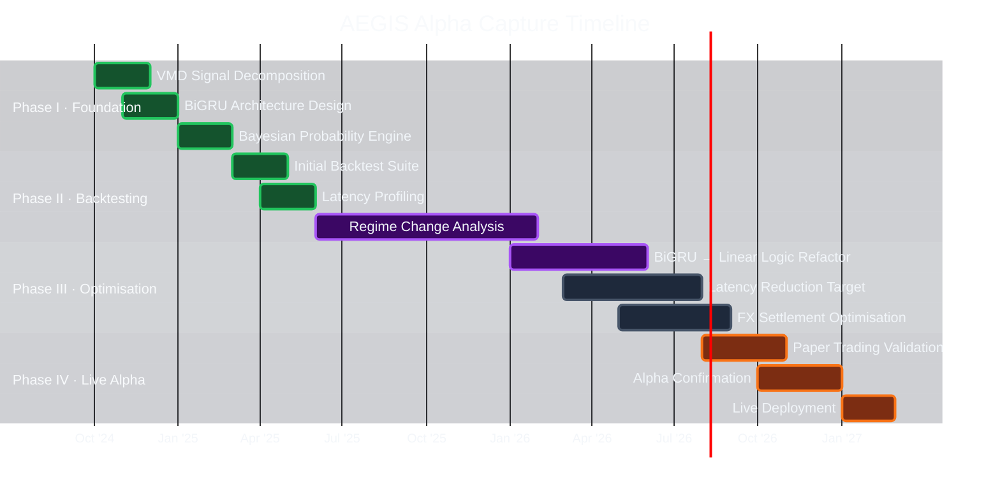

<div align="center">

```
╔═══════════════════════════════════════════════════════════════╗
║                                                               ║
║        ░█████╗░███████╗░██████╗░██╗░██████╗                  ║
║        ██╔══██╗██╔════╝██╔════╝░██║██╔════╝                  ║
║        ███████║█████╗░░██║░░██╗░██║╚█████╗░                  ║
║        ██╔══██║██╔══╝░░██║░░╚██╗██║░╚═══██╗                  ║
║        ██║░░██║███████╗╚██████╔╝██║██████╔╝                  ║
║        ╚═╝░░╚═╝╚══════╝░╚═════╝░╚═╝╚═════╝                   ║
║                                                               ║
║     D U A L - M A R K E T   C A P I T A L   R O T A T I O N  ║
╚═══════════════════════════════════════════════════════════════╝
```

# AEGIS · VMD-BiGRU Capital Rotation Engine

**`SSE` · `NASDAQ` · `HKEx`**

[](.)
[](.)
[](.)
[](.)
[](.)

> *High-frequency, dual-market capital rotation strategy using Variational Mode Decomposition and Bidirectional Gated Recurrent Units with Bayesian probability updating, rotating capital dynamically between A-shares and US equities via HKEx FX settlement.*

</div>

---

<div align="center">

## System Architecture

</div>


```mermaid
%%{init: {
  "theme": "base",
  "themeVariables": {
    "primaryColor": "#0f172a",
    "primaryTextColor": "#e2e8f0",
    "primaryBorderColor": "#334155",
    "lineColor": "#94a3b8",
    "secondaryColor": "#1e293b",
    "tertiaryColor": "#0f172a",
    "background": "#020617",
    "mainBkg": "#0f172a",
    "nodeBorder": "#475569",
    "clusterBkg": "#1e293b",
    "titleColor": "#f8fafc",
    "edgeLabelBackground": "#1e293b",
    "attributeBackgroundColorEven": "#1e293b",
    "attributeBackgroundColorOdd": "#0f172a"
  }
} }%%
flowchart TD
    classDef data fill:#1e3a5f,stroke:#3b82f6,stroke-width:2px,color:#bfdbfe,font-weight:bold
    classDef front fill:#0c4a6e,stroke:#0ea5e9,stroke-width:2px,color:#bae6fd,font-weight:bold
    classDef middle fill:#3b0764,stroke:#a855f7,stroke-width:2px,color:#e9d5ff,font-weight:bold
    classDef back fill:#14532d,stroke:#22c55e,stroke-width:2px,color:#bbf7d0,font-weight:bold
    classDef exec fill:#7c2d12,stroke:#f97316,stroke-width:2px,color:#fed7aa,font-weight:bold
    classDef hold fill:#1e293b,stroke:#64748b,stroke-width:2px,color:#cbd5e1,font-weight:bold

    subgraph Data["  HIGH-FREQUENCY MARKET DATA FEEDS  "]
        A1[(SSE\nTick Data)]:::data
        A2[(NASDAQ\nTick Data)]:::data
        A3[(HKEx FX\nTick Data)]:::data
    end

    subgraph Front["  FRONT-END · SIGNAL ENGINEERING  "]
        B1["Micro-Market Data Aggregation\nOrder Book  ·  OHLCV Ticks"]:::front
        B2["Technical Indicator\nCalculation Engine"]:::front
        B3["Fast VMD\nDecompose Noise from Signal"]:::front
    end

    subgraph Middle["  MIDDLE-END · BAYESIAN PROBABILITY ENGINE  "]
        C1["BiGRU Network\nBidirectional Sequence Feature Extraction"]:::middle
        C2["Likelihood Estimator\nP( Signal | Profit )"]:::middle
        C3(["Bayesian Updater\nPosterior  ∝  Likelihood  ×  Prior"]):::middle
        C4[("Rolling Bias State\nPosterior → Next Prior")]:::middle
        C5{"P( Profit ) > 60% ?"}:::middle
    end

    subgraph Back["  BACK-END · T+0 STRATEGY LOGIC  "]
        D1["Micro-Transaction Cost Calc\nSpread  +  Fees  +  FX Slippage"]:::back
        D2{"Net Expected\nYield > 0 ?"}:::back
        D3["Clock Manager\nRoutes to Active Market Window"]:::back
    end

    subgraph Exec["  EXECUTION · CAPITAL ROTATION LAYER  "]
        E1(["SSE Trade\nHigh-Freq Buy / Sell"]):::exec
        E2(["HKEx FX Settlement\nCNY  ↔  CNH  ↔  USD"]):::exec
        E3(["NASDAQ Trade\nHigh-Freq Buy / Sell"]):::exec
    end

    Hold(["HOLD / LIQUIDATE\nNo Edge Detected"]):::hold

    A1 & A2 & A3 --> B1
    B1 --> B2 --> B3 --> C1
    C1 --> C2 --> C3
    C4 -. "Prior\nProbability" .-> C3
    C3 -- "Updates" --> C4
    C3 -- "Current\nProbability" --> C5
    C5 -- "YES › ACTION" --> D1
    C5 -- "NO › INACTION" --> Hold
    D1 --> D2
    D2 -- "Profitable" --> D3
    D2 -- "Costs Too High" --> Hold
    D3 -- "China Hours" --> E1
    D3 -- "U.S. Hours" --> E3
    E1 -- "Liquidate &\nConvert" --> E2
    E2 -- "Transfer\nFunds →" --> E3
    E3 -- "Liquidate &\nConvert" --> E2
    E2 -- "Transfer\nFunds →" --> E1
```

---

<div align="center">

## Component Breakdown

</div>


```mermaid
%%{init: {"theme": "base", "themeVariables": {"primaryColor": "#1e293b", "primaryTextColor": "#f1f5f9", "primaryBorderColor": "#475569", "lineColor": "#64748b", "background": "#0f172a", "mainBkg": "#1e293b", "titleColor": "#f8fafc"}} }%%
mindmap
  root(("AEGIS\nCore"))
    Data Layer
      SSE Tick Feed
      NASDAQ Tick Feed
      HKEx FX Feed
      Order Book Depth
    Signal Engineering
      OHLCV Aggregation
      Technical Indicators
        RSI · MACD · BB
      Fast VMD
        Mode Decomposition
        Noise Suppression
    Prediction Engine
      BiGRU Network
        Forward Pass
        Backward Pass
      Bayesian Updater
        Likelihood Estimation
        Posterior Rolling State
      60% Profit Threshold
    Risk & Execution
      Transaction Cost Model
        Spread Analysis
        Fee Calculation
        FX Slippage
      Clock Manager
        China Session
        US Session
      Capital Rotation
        CNY ↔ CNH ↔ USD
```

---

<div align="center">

## Model Performance & Backtest Status

</div>


```mermaid
%%{init: {"theme": "base", "themeVariables": {"primaryColor": "#1e293b", "primaryTextColor": "#f1f5f9", "primaryBorderColor": "#475569", "lineColor": "#64748b", "background": "#0f172a"}} }%%
xychart-beta
    title "Latency Profile vs. Target Threshold (ms)"
    x-axis ["BiGRU Pass", "VMD Decomp", "Bayesian Upd", "Cost Calc", "FX Routing", "TARGET"]
    y-axis "Latency (ms)" 0 --> 1.0
    bar [0.80, 0.45, 0.20, 0.15, 0.10, 0.05]
    line [0.05, 0.05, 0.05, 0.05, 0.05, 0.05]
```


```mermaid
%%{init: {"theme": "base", "themeVariables": {"primaryColor": "#1e293b", "primaryTextColor": "#e2e8f0", "background": "#0f172a", "pie1": "#3b82f6", "pie2": "#a855f7", "pie3": "#22c55e", "pie4": "#f97316", "pie5": "#ef4444"}} }%%
pie title Latency Budget Breakdown
    "BiGRU Inference" : 38
    "VMD Decomposition" : 27
    "Bayesian Update" : 16
    "Cost Calculation" : 11
    "FX / Routing" : 8
```

---

<div align="center">

## Development Roadmap

</div>


```mermaid
%%{init: {"theme": "base", "themeVariables": {"primaryColor": "#1e293b", "primaryTextColor": "#f1f5f9", "primaryBorderColor": "#475569", "lineColor": "#64748b", "background": "#0f172a", "mainBkg": "#1e293b", "titleColor": "#f8fafc", "taskBkgColor": "#1e293b", "taskBorderColor": "#475569", "taskTextColor": "#e2e8f0", "activeTaskBkgColor": "#3b0764", "activeTaskBorderColor": "#a855f7", "doneTaskBkgColor": "#14532d", "doneTaskBorderColor": "#22c55e", "critBkgColor": "#7c2d12", "critBorderColor": "#f97316", "sectionBkgColor": "#020617", "altSectionBkgColor": "#0f172a", "gridColor": "#334155"}} }%%
gantt
    title AEGIS Alpha Capture Timeline
    dateFormat YYYY-MM
    axisFormat %b '%y

    section Phase I · Foundation
    VMD Signal Decomposition        :done,    p1a, 2024-10, 2024-12
    BiGRU Architecture Design       :done,    p1b, 2024-11, 2025-01
    Bayesian Probability Engine     :done,    p1c, 2025-01, 2025-03

    section Phase II · Backtesting
    Initial Backtest Suite          :done,    p2a, 2025-03, 2025-05
    Latency Profiling               :done,    p2b, 2025-04, 2025-06
    Regime Change Analysis          :active,  p2c, 2025-06, 2026-02

    section Phase III · Optimisation
    BiGRU → Linear Logic Refactor   :active,  p3a, 2026-01, 2026-06
    Latency Reduction Target        :         p3b, 2026-03, 2026-08
    FX Settlement Optimisation      :         p3c, 2026-05, 2026-09

    section Phase IV · Live Alpha
    Paper Trading Validation        :crit,    p4a, 2026-08, 2026-11
    Alpha Confirmation              :crit,    p4b, 2026-10, 2027-01
    Live Deployment                 :crit,    p4c, 2027-01, 2027-03
```

---

<div align="center">

## Research Notes

</div>

> **`[BACKTEST STATUS: NON-VIABLE]`**
>
> Currently, it is not viable, as seen from backtests (output), because the model struggles with high latency due to the deep learning addition and regime changes. Alpha will be achieved sooner or later; the Bi-GRU model will be filtered and replicated through linear logic instead.
>
> The primary bottleneck is deep learning inference latency (`0.10–0.80ms`), which exceeds the execution threshold for true HFT.

```
┌─────────────────────────────────────────────────────────────┐
│  KNOWN CONSTRAINTS                                          │
│  ─────────────────                                          │
│  *  BiGRU latency:  0.10 – 0.80ms  (target: < 0.05ms)     │
│  *  Regime sensitivity: alpha decay during transitions     │
│  *  FX settlement friction: CNY ↔ CNH spread costs        │
│                                                             │
│  PLANNED MITIGATIONS                                        │
│  ────────────────────                                       │
│  +  Replace BiGRU with linear approximation model         │
│  +  Implement regime-aware Bayesian prior switching        │
│  +  Optimise HKEx settlement timing & batch routing       │
└─────────────────────────────────────────────────────────────┘
```

---

<div align="center">

**AEGIS** · *Alpha will be achieved.*

`VMD` · `BiGRU` · `Bayesian Inference` · `T+0` · `HFT` · `Capital Rotation`

---

*Research repository — not financial advice.*

</div>
