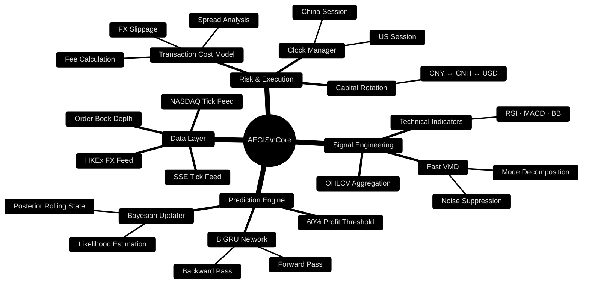
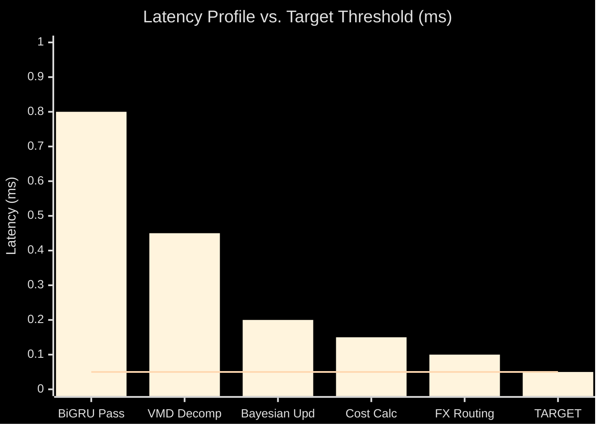
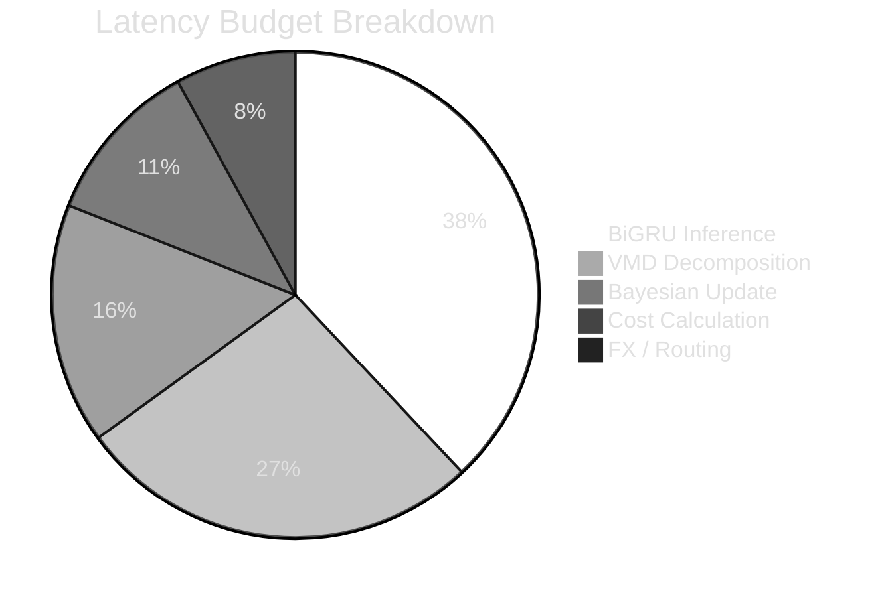
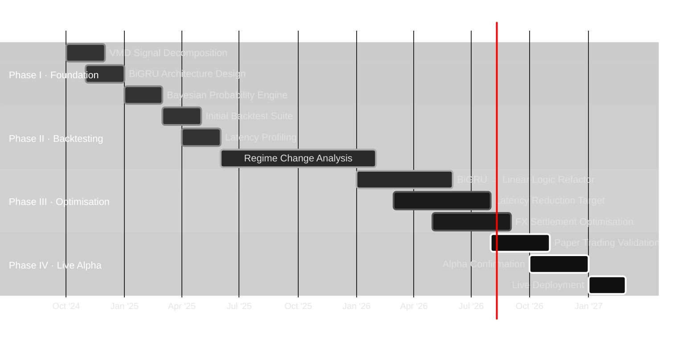

<div align="center">

```
╔═════════════════════════════════════════════════════╗
║                                                     ║
║        ░█████╗░███████╗░██████╗░██╗░██████╗         ║
║        ██╔══██╗██╔════╝██╔════╝░██║██╔════╝         ║
║        ███████║█████╗░░██║░░██╗░██║╚█████╗░         ║
║        ██╔══██║██╔══╝░░██║░░╚██╗██║░╚═══██╗         ║
║        ██║░░██║███████╗╚██████╔╝██║██████╔╝         ║
║        ╚═╝░░╚═╝╚══════╝░╚═════╝░╚═╝╚═════╝          ║
║                                                     ║
╚═════════════════════════════════════════════════════╝
```

# AEGIS · VMD-BiGRU Capital Rotation

**`SSE` · `NASDAQ` · `HKEx`**


> *High-frequency, dual-market capital rotation strategy using Variational Mode Decomposition and Bidirectional Gated Recurrent Units with Bayesian probability updating, rotating capital dynamically between A-shares and US equities via HKEx FX settlement.*

</div>

---

<div align="center">

## System Architecture

</div>


```mermaid
%%{init: {
  "theme": "base",
  "themeVariables": {
    "primaryColor": "#1a1a1a",
    "primaryTextColor": "#e0e0e0",
    "primaryBorderColor": "#444444",
    "lineColor": "#888888",
    "secondaryColor": "#2a2a2a",
    "tertiaryColor": "#111111",
    "background": "#000000",
    "mainBkg": "#1a1a1a",
    "nodeBorder": "#555555",
    "clusterBkg": "#222222",
    "titleColor": "#ffffff",
    "edgeLabelBackground": "#1a1a1a",
    "attributeBackgroundColorEven": "#1a1a1a",
    "attributeBackgroundColorOdd": "#111111"
  }
} }%%
flowchart TD
    classDef data fill:#1a1a1a,stroke:#aaaaaa,stroke-width:2px,color:#e0e0e0,font-weight:bold
    classDef front fill:#1a1a1a,stroke:#cccccc,stroke-width:2px,color:#ffffff,font-weight:bold
    classDef middle fill:#111111,stroke:#999999,stroke-width:2px,color:#dddddd,font-weight:bold
    classDef back fill:#222222,stroke:#bbbbbb,stroke-width:2px,color:#eeeeee,font-weight:bold
    classDef exec fill:#0d0d0d,stroke:#ffffff,stroke-width:2px,color:#ffffff,font-weight:bold
    classDef hold fill:#2a2a2a,stroke:#666666,stroke-width:2px,color:#aaaaaa,font-weight:bold

    subgraph Data["  HIGH-FREQUENCY MARKET DATA FEEDS  "]
        A1[(SSE\nTick Data)]:::data
        A2[(NASDAQ\nTick Data)]:::data
        A3[(HKEx FX\nTick Data)]:::data
    end

    subgraph Front["  FRONT-END · SIGNAL ENGINEERING  "]
        B1["Micro-Market Data Aggregation\nOrder Book  ·  OHLCV Ticks"]:::front
        B2["Technical Indicator\nCalculation Engine"]:::front
        B3["Fast VMD\nDecompose Noise from Signal"]:::front
    end

    subgraph Middle["  MIDDLE-END · BAYESIAN PROBABILITY ENGINE  "]
        C1["BiGRU Network\nBidirectional Sequence Feature Extraction"]:::middle
        C2["Likelihood Estimator\nP( Signal | Profit )"]:::middle
        C3(["Bayesian Updater\nPosterior  ∝  Likelihood  ×  Prior"]):::middle
        C4[("Rolling Bias State\nPosterior → Next Prior")]:::middle
        C5{"P( Profit ) > 60% ?"}:::middle
    end

    subgraph Back["  BACK-END · T+0 STRATEGY LOGIC  "]
        D1["Micro-Transaction Cost Calc\nSpread  +  Fees  +  FX Slippage"]:::back
        D2{"Net Expected\nYield > 0 ?"}:::back
        D3["Clock Manager\nRoutes to Active Market Window"]:::back
    end

    subgraph Exec["  EXECUTION · CAPITAL ROTATION LAYER  "]
        E1(["SSE Trade\nHigh-Freq Buy / Sell"]):::exec
        E2(["HKEx FX Settlement\nCNY  ↔  CNH  ↔  USD"]):::exec
        E3(["NASDAQ Trade\nHigh-Freq Buy / Sell"]):::exec
    end

    Hold(["HOLD / LIQUIDATE\nNo Edge Detected"]):::hold

    A1 & A2 & A3 --> B1
    B1 --> B2 --> B3 --> C1
    C1 --> C2 --> C3
    C4 -. "Prior\nProbability" .-> C3
    C3 -- "Updates" --> C4
    C3 -- "Current\nProbability" --> C5
    C5 -- "YES › ACTION" --> D1
    C5 -- "NO › INACTION" --> Hold
    D1 --> D2
    D2 -- "Profitable" --> D3
    D2 -- "Costs Too High" --> Hold
    D3 -- "China Hours" --> E1
    D3 -- "U.S. Hours" --> E3
    E1 -- "Liquidate &\nConvert" --> E2
    E2 -- "Transfer\nFunds →" --> E3
    E3 -- "Liquidate &\nConvert" --> E2
    E2 -- "Transfer\nFunds →" --> E1
```

---

<div align="center">

## Component Breakdown

</div>


```mermaid
%%{init: {"theme": "base", "themeVariables": {"primaryColor": "#1a1a1a", "primaryTextColor": "#e0e0e0", "primaryBorderColor": "#555555", "lineColor": "#777777", "background": "#000000", "mainBkg": "#1a1a1a", "titleColor": "#ffffff"}} }%%
mindmap
  root(("AEGIS\nCore"))
    Data Layer
      SSE Tick Feed
      NASDAQ Tick Feed
      HKEx FX Feed
      Order Book Depth
    Signal Engineering
      OHLCV Aggregation
      Technical Indicators
        RSI · MACD · BB
      Fast VMD
        Mode Decomposition
        Noise Suppression
    Prediction Engine
      BiGRU Network
        Forward Pass
        Backward Pass
      Bayesian Updater
        Likelihood Estimation
        Posterior Rolling State
      60% Profit Threshold
    Risk & Execution
      Transaction Cost Model
        Spread Analysis
        Fee Calculation
        FX Slippage
      Clock Manager
        China Session
        US Session
      Capital Rotation
        CNY ↔ CNH ↔ USD
```

---

<div align="center">

## Model Performance & Backtest Status

</div>


```mermaid
%%{init: {"theme": "base", "themeVariables": {"primaryColor": "#1a1a1a", "primaryTextColor": "#e0e0e0", "primaryBorderColor": "#555555", "lineColor": "#777777", "background": "#000000"}} }%%
xychart-beta
    title "Latency Profile vs. Target Threshold (ms)"
    x-axis ["BiGRU Pass", "VMD Decomp", "Bayesian Upd", "Cost Calc", "FX Routing", "TARGET"]
    y-axis "Latency (ms)" 0 --> 1.0
    bar [0.80, 0.45, 0.20, 0.15, 0.10, 0.05]
    line [0.05, 0.05, 0.05, 0.05, 0.05, 0.05]
```


```mermaid
%%{init: {"theme": "base", "themeVariables": {"primaryColor": "#1a1a1a", "primaryTextColor": "#e0e0e0", "background": "#000000", "pie1": "#ffffff", "pie2": "#aaaaaa", "pie3": "#777777", "pie4": "#444444", "pie5": "#222222"}} }%%
pie title Latency Budget Breakdown
    "BiGRU Inference" : 38
    "VMD Decomposition" : 27
    "Bayesian Update" : 16
    "Cost Calculation" : 11
    "FX / Routing" : 8
```

---

<div align="center">

## Development Roadmap

</div>


```mermaid
%%{init: {"theme": "base", "themeVariables": {"primaryColor": "#1a1a1a", "primaryTextColor": "#e0e0e0", "primaryBorderColor": "#555555", "lineColor": "#777777", "background": "#000000", "mainBkg": "#1a1a1a", "titleColor": "#ffffff", "taskBkgColor": "#1a1a1a", "taskBorderColor": "#555555", "taskTextColor": "#dddddd", "activeTaskBkgColor": "#2a2a2a", "activeTaskBorderColor": "#aaaaaa", "doneTaskBkgColor": "#333333", "doneTaskBorderColor": "#888888", "critBkgColor": "#111111", "critBorderColor": "#ffffff", "sectionBkgColor": "#000000", "altSectionBkgColor": "#0d0d0d", "gridColor": "#333333"}} }%%
gantt
    title AEGIS Timeline
    dateFormat YYYY-MM
    axisFormat %b '%y

    section Phase I · Foundation
    VMD Signal Decomposition        :done,    p1a, 2024-10, 2024-12
    BiGRU Architecture Design       :done,    p1b, 2024-11, 2025-01
    Bayesian Probability Engine     :done,    p1c, 2025-01, 2025-03

    section Phase II · Backtesting
    Initial Backtest Suite          :done,    p2a, 2025-03, 2025-05
    Latency Profiling               :done,    p2b, 2025-04, 2025-06
    Regime Change Analysis          :active,  p2c, 2025-06, 2026-02

    section Phase III · Optimisation
    BiGRU → Linear Logic Refactor   :active,  p3a, 2026-01, 2026-06
    Latency Reduction Target        :         p3b, 2026-03, 2026-08
    FX Settlement Optimisation      :         p3c, 2026-05, 2026-09

    section Phase IV · Live Alpha
    Paper Trading Validation        :crit,    p4a, 2026-08, 2026-11
    Alpha Confirmation              :crit,    p4b, 2026-10, 2027-01
    Live Deployment                 :crit,    p4c, 2027-01, 2027-03
```

---

<div align="center">

## Research Notes

</div>

> **`[BACKTEST STATUS: NON-VIABLE]`**
>
> Currently, it is not viable, as seen from backtests (output), because the model struggles with high latency due to the deep learning addition and regime changes. Alpha will be achieved sooner or later; the Bi-GRU model will be filtered and replicated through linear logic instead.
>
> The primary bottleneck is deep learning inference latency (`0.10–0.80ms`), which exceeds the execution threshold for true HFT.

---

<div align="center">

**AEGIS**
</div>
